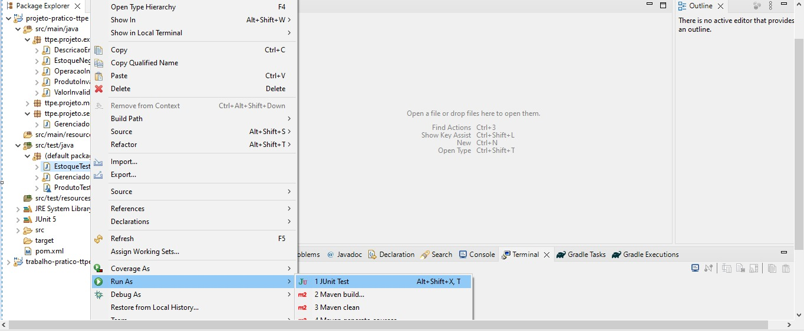

# Trabalho-Pratico1-TTPE-2023-2

## Integrantes do grupo

| Nome | Matrícula |
| -- | -- |
| Eurico Menezes de Abreu Neto | 200017519 |
| Felipe Correia Andrade | 180113259 |
| Mateus Brandão Teixeira | 180127535 |
| Matheus S. | X |

## Controle de Estoque e Inventário - Projeto TDD

Este é um projeto Java que implementa funcionalidades básicas de controle de estoque e inventário, utilizando a abordagem de Desenvolvimento Orientado por Testes (TDD). Foram utilizados conceitos de Orientação a Objetos e o framework de testes JUnit 5.

### Funcionalidades Implementadas

#### 1. Cadastro de Produtos

- Cadastro de produtos no sistema com informações obrigatórias.
- Lançamento de exceções em casos de dados faltantes ou inválidos.

#### 2. Consulta de Estoque

- Recuperação de produtos em buscas por nome ou código de barras.

#### 3. Gestão de Transações

- Realização de diversos tipos de transações (recebimento, vendas, transferências, devoluções, ajustes).
- Lançamento de exceção para quantidades negativas, exceto para ajustes.

#### 4. Alertas de Estoque Baixo

- Emissão de alerta quando o estoque atinge o limite mínimo.
- Lançamento de exceção em caso de estoque negativo após movimentação.

#### 5. Rastreamento de Lotes e Validade

- Informação correta da quantidade total de itens e lotes.
- Emissão de alerta para lotes próximos à data de validade e atualização de preço.

## Intruções

Para rodar nosso projeto deverá realizar o clone do repositório

``
git clone https://github.com/mateusbrandaot/Projeto-Pratico-TTPE.git
``

Após isso, precisa ter instalado e configurado o Maven e também Java. Sugerimos também uma IDE a sua escolha (Eclipse ou IntelliJ)

E executar os Testes com o JUnit5

